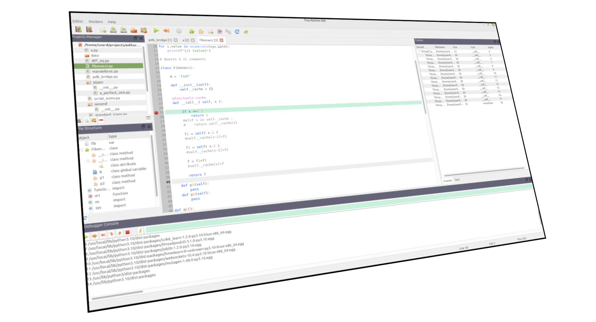

# TIDE-PY: Tiny IDE for PYthon #

Eclipse and others professional IDEs are very good as python IDE, at the expense of memory consumption. This could be a problem if you don't have much of it or you don't need all the features they provide. 
You can use some IDE of the Vim's family , if you are very good at keyboard games and to remember command key-sequence. That was not my case.

In this situation a better solution could be a "bare minimum" IDE with low memory footprint and easier to use, wich you can hack "faster" than other program. 
That's where TIDEPY comes in. 

## Features: ##

1. Python editor with syntax highlighting , settable tab size, line numbers, bracket matching and a bare minimum of auto completion functions built from a static words set.
2. Text search/replace functionality with grep family commands.
3. Python source code structure tree viewer.
4. Automatic build of basic Python language structure from selected text.
5. Projects tree manager.
6. Simple debugger ( in this version only the main thread can be debugged [ single thread ] ).
7. Frames/Watches viewer.
8. Expression inspector at runtime.
 

## Other features of TIDE-PY:  ##
It is built using Qt5.15 and it's been developed for Linux environment only. 
The fact that 99% of the code is using Qt means that it can be run on Windows with few changes ( which I won't do  ) : 
think switching toward better solutions anyway ( remember 07/19 2024  )

## Install dependencies: ##

1.    Python3.10 or later
2.    Qt5 or later
3.    [rapid_xml](https://github.com/0x08088405/rapidxml) from  Marcin Kalicinski. ( Boost SoftwareLicense )
4.    [json for modern c++](https://github.com/nlohmann/json) from Niels Lohmann. ( MIT-License )
5.    [Boost.Process ](https://github.com/boostorg/process) from Julio M. Merino Vidal, Ilya Sokolov, Felipe Tanus, Jeff Flinn, Boris Schaeling, Klemens D. Morgenstern (Boost Software License, Version 1.0.)

## Status ##

Far from being in a release state , but mostly playable.

## Build and Installing

### Qt
You need Qt 5.15 or later installed.
So if you have installed also QtCreator just open the tidepy.pro file compile and run.

### CMake
from the project dir execute the session:

mkdir build

cd build

cmake ..

make

# Tiny User Manual: #

The following are few usage hints .

All the main control widgets are dockable control. If you close the window of one control , you can recall it with the menu Dockers in the main window.

### Project Tree Manager ###

The project manager can open multiple project dirs at the same time.
Remember that except loading/unloading the projects directories  all other operations are filesystem based : **the operation are made on the filesystem immediately !**.
If you try to delete a file a popup will appear to inform you that it will be deleted from the filesystem. Than you can accept or cancel the operation.
To change the name of a file just click the corresponding node in the tree and then click it again ( no double click ).

### Debugger ###

The following shorcuts are in place :

1. F5 > step into the function.
2. F6 > step over the next line .
3. F7 > continue .
4. F8 > step out of function.
5. F11 > stop the debugger.

The command line is represented by the white/green/red line . 

**White** means no interaction.
**Green** means debug time : you can insert python command and then press return to see the result. 
**Red** means the program ask for user input.

When the debugger finish the job it prints a green 'EXIT' in the console.
If things get crazy there's the stop button.

### Watches/Frames stack:

You have to use the add / delete buttons to change the list of watches.
In the stackframe list when you select an element the vars should change values accordingly.

### Python source code tree:

Except durings the first opening of the file , the built of the source tree is not automatic. You have to use the refresh button.

### Search tool:

The search is using grep/egrep. The result are presented in a list showing : filename , lineno and the interested text.
The replacement is made on all the files in the result list. At the moment there isn't the possibility to exclude any entry in the list.

